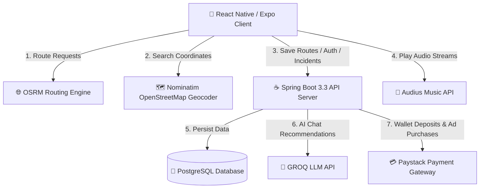

# 🚀 Pathy (formerly SafeTrack)

<p align="center">
  
</p>

An AI-powered navigation, safety tracking, and community explorer platform. Users can discover and record routes, report real-time hazards or incidents on a live map, consult an intelligent AI travel assistant, play synchronized music, run localized business campaigns, and track travel achievements.


---

## 🏗️ System Architecture

Pathy uses a modern, modular client-server structure:



---

## 🌟 Key Functional Features

### 1. Saved Routes & Feed
- **Your Routes**: A horizontal, swipeable gallery directly on the Home screen displaying personal saved route metrics (distance in km, duration, activity category, and quick-post buttons).
- **Interactive Map Picker**: Seamlessly select destinations using the in-app map search bar or by long-pressing anywhere on the map grid. The path is automatically generated via the OpenStreetMap routing API, displaying time/distance info.
- **Community Feed**: Post public routes with customizable captions, descriptions, and live mini-maps displaying start and end markers. Fellow users can like, review, and comment on routes in real-time.

### 2. Live Incident Map & Alerts
- Real-time reporting of safety issues: **Accidents, Hazards, Crimes, Weather, and Custom alerts**.
- Interactive map markers colored dynamically by severity (Low, Medium, High, Critical) with automatic expiration countdowns.
- Detailed overlay sheets containing images, description metadata, and quick directions/navigation shortcuts.

### 3. Pathy AI Travel Companion
- AI Chat screen powered by the **GROQ API** using LLM completions.
- Provides tailored navigation tips, route safety suggestions, local warnings, and answers travel questions.
- Preserves a clean history of your messages locally and on the server database.

### 4. Global Music Player & Streaming
- Synchronized music playback powered by **Zustand global state**. Plays audio streams seamlessly in the background across all tabs and screens.
- **Discover**: Stream trending music tracks directly from the Audius API (no API key required).
- **Library**: Upload personal audio files (MP3/M4A) via Spring Boot's multipart upload endpoint. Handles cached playback offline. Preserves file formats correctly to ensure high-fidelity playback.

### 5. Merchant Ad Portal (Proximity Ads)
- Businesses can set up active advertisement zones with custom radiuses (in kilometers) on the map.
- Automatic device proximity alerts: alerts users when they approach a business's coordinates.
- Fully integrated with the user's **Internal Wallet** system.

### 6. Wallet & Deposit System
- **Deposits**: Users can top up their wallet balance using **Paystack Payment Gateway** payments.
- **Ad Campaigns**: Merchant ads can be purchased and activated instantly by deducting fees directly from the traveler/business wallet balance.

### 7. Competitive Leaderboard
- Displays user rankings based on route distances.
- **Haversine Formula Calculation**: Backend calculates exact distance dynamically in SQL using spatial spherical trigonometry over coordinates (`origin_lat`/`lng` to `destination_lat`/`lng`).
- Features a visual **Rank Podium** for the top 3 users and a scrolling leaderboard list of all active participants.
- Provides toggle filtering for **All-Time** vs. **Weekly** metrics.

---

## 🐘 Database Schema

The database utilizes PostgreSQL and is structured as follows:

- **`users`**: Tracks traveler credentials, verification states (`is_verified`), and wallet funds (`balance`).
- **`incidents`**: Stores locations, types, and severity levels of reported traffic hazards.
- **`saved_routes`**: Logs route geo-endpoints, names, and raw geo JSON coordinates.
- **`ads`**: Stores sponsored local pins, website targets, and campaign validity dates.
- **`chat_messages`**: Saves persistent histories of AI travel dialogs.
- **`music_tracks`**: Stores music metadata and file upload links.
- **`playlists`** & **`playlist_tracks`**: Defines user playlist relationships.
- **`deposits`**: Logs wallet transaction top-ups via Paystack.

---

## 📂 Project Structure

```bash
PathyCodequestProject/
├── Frontend/                 # React Native / Expo Client
│   ├── assets/               # Local logos, icons, and image resources
│   ├── src/
│   │   ├── config/           # Theme palettes, dark mode context (useColors)
│   │   ├── screens/          # Application views (Home, Map, Music, Leaderboard, etc.)
│   │   ├── services/         # API abstraction layer (Axios wrappers)
│   │   └── store/            # Zustand global state (auth, music, incidents, ads)
│   ├── App.tsx               # Main entrypoint, stack/tab navigators
│   └── .env                  # Client-side environment variables
│
└── backend/                  # Java / Spring Boot Microservice
    ├── src/
    │   ├── main/java/        # Spring boot controllers, services, repositories
    │   └── main/resources/   # Central application.yml configuration & SQL schema
    ├── Dockerfile            # Container configuration
    ├── docker-compose.yml    # Database / caching orchestrator
    └── .env                  # Secret keys (GROQ, PAYSTACK, database credentials)
```

---

## 🚀 Getting Started

### Prerequisites
Make sure you have the following installed locally:
- **Node.js** (v18+) & npm
- **Java JDK 21** & **Maven**
- **Docker Desktop** (optional, for database containerization)

---

### 1. Database Setup
You can spin up the PostgreSQL database instantly using Docker Compose inside the `backend` folder:
```bash
cd backend
docker compose up -d
```
*Alternatively, configure a local PostgreSQL database matching the credentials in `backend/src/main/resources/application.yml`.*

---

### 2. Run the Backend API
Create a `.env` file in the `backend` folder with the following variables:
```env
DB_URL=jdbc:postgresql://localhost:5432/safetrack
DB_USER=postgres
DB_PASSWORD=postgres
GROQ_API_KEY=your_groq_api_key
PAYSTACK_SECRET_KEY=your_paystack_secret_key
JWT_SECRET=your_super_secret_jwt_encryption_key
```

Run the Spring Boot application using Maven:
```bash
mvn clean install
mvn spring-boot:run
```
The server will start listening at `http://localhost:4000`.

---

### 3. Run the Mobile Frontend
Create a `.env` file in the `Frontend` folder pointing to your backend address:
```env
EXPO_PUBLIC_API_URL=http://localhost:4000/api
```
*(If testing on a physical mobile device, replace `localhost` with your computer's local IP address e.g., `192.168.1.100` or use an active `ngrok` tunnel).*

Install packages and run the Expo development bundler:
```bash
cd Frontend
npm install
npm run start
```
Scan the QR code in your console using the **Expo Go** application on your iOS or Android device.

---

## ⚙️ Backend REST API Specification

| Endpoint | Method | Description | Auth Required |
|----------|--------|-------------|:-------------:|
| `/api/auth/register` | `POST` | Create a new traveler account | No |
| `/api/auth/login` | `POST` | Authenticate credentials and return JWT token | No |
| `/api/auth/forgot-password` | `POST` | Trigger password reset verification email | No |
| `/api/auth/verify-reset` | `POST` | Confirm OTP validation code | No |
| `/api/auth/reset-password` | `POST` | Apply new secure credentials | No |
| `/api/incidents` | `GET`/`POST` | Retrieve and post real-time hazards | Yes |
| `/api/routes` | `GET`/`POST` | Retrieve and save recorded route paths | Yes |
| `/api/routes/leaderboard` | `GET` | Get all-time user rankings by route distance | Yes |
| `/api/routes/leaderboard/weekly` | `GET` | Get current week user rankings | Yes |
| `/api/wallet/deposit` | `POST` | Log and verify a Paystack deposit reference | Yes |
| `/api/music/tracks` | `GET`/`POST`/`DELETE` | Retrieve, upload, and remove personal library tracks | Yes |
| `/api/music/playlists` | `GET`/`POST` | Create and retrieve playlists | Yes |
| `/api/ai/chat` | `POST` | Query the Pathy AI Assistant | Yes |
| `/api/ads` | `GET`/`POST` | Retrieve and launch sponsored campaigns | Yes |
| `/api/ads/{id}/activate` | `POST` | Deduct balance and activate merchant pin | Yes |

