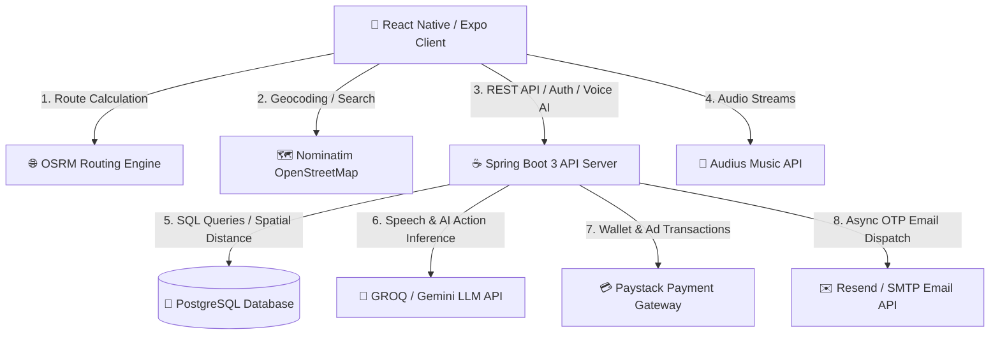

# 🚀 Pathy (AI-Powered Navigation & Safety Explorer)

<p align="center">
  
</p>

**Pathy** is a full-stack, AI-powered navigation, traffic safety tracking, and merchant exploration platform. Built with **React Native (Expo)** on the frontend and **Java (Spring Boot 3)** on the backend, Pathy empowers users to navigate safely, report hazards, stream music, run localized proximity ads, and interact with a voice-enabled AI travel assistant that can automatically control and populate forms across the application.

---

## 📐 System Architecture



---

## 🔐 1. Authentication Architecture

Pathy implements a stateless **JWT (JSON Web Token)** security flow engineered via Spring MVC Interceptors:

- **Password Encryption**: Users' credentials are hashed using `BCryptPasswordEncoder` (cost factor 10).
- **Stateless Authorization**: Protected REST endpoints inspect the `Authorization: Bearer <token>` HTTP header using a custom Spring `AuthInterceptor`.
- **JWT Claim Structure**: Tokens are signed with an **HMAC-SHA256** secret key (`JWT_SECRET`) and carry `id` (UUID) and `email` claims with a 7-day expiration.
- **Whitelisted Public Endpoints**:
  - `/api/auth/**` (Register, Login, Password Reset, Email Verification)
  - `/api/health`
  - `GET /api/incidents`
  - `GET /api/ads`
- **Email Verification & OTP Flow**:
  - Sends a 6-digit numeric OTP code (expires in 15 minutes) saved in the `verification_codes` database table.
  - Dual delivery pipeline: Uses **Resend HTTP API** (`https://api.resend.com/emails` on Port 443) as primary to bypass cloud firewall restrictions (e.g. Railway/Render), falling back to JavaMail SMTP.
  - Asynchronous background execution (`CompletableFuture.runAsync`) returns instant HTTP 200 responses to frontend callers.

---

## 🐘 2. Database Architecture & Schema

The backend uses **PostgreSQL 15+** with relational schema management enabled via `schema.sql`.

### Key Tables & Relations

1. `users`: Stores user identity, bcrypt hash, avatar link, verification state (`is_verified`), and internal wallet balance (`balance`).
2. `incidents`: Real-time traffic hazard alerts (`type`, `title`, `description`, `latitude`, `longitude`, `severity`, `status`, `media_url`).
3. `saved_routes`: User-saved navigation routes containing JSONB route geometries and favorite status.
4. `ads`: Proximity merchant ad campaigns with geo-coordinates, target radius in km (`radius_km`), payment state, and expiry timestamps.
5. `chat_messages`: Persistent history of Pathy AI conversations.
6. `music_tracks` & `playlists`: User-uploaded music library metadata and playlist relationships.
7. `deposits`: Wallet top-up transactions verified against Paystack payment references.
8. `verification_codes`: Temporary 6-digit OTP tokens for password resets and account verification.

### Spherical Spatial Calculations (Haversine Formula)

Leaderboards and proximity queries execute spherical trigonometry directly in PostgreSQL for maximum performance:
```sql
SELECT id, business_name,
  (6371 * acos(
    cos(radians(:lat)) * cos(radians(latitude)) *
    cos(radians(longitude) - radians(:lng)) +
    sin(radians(:lat)) * sin(radians(latitude))
  )) AS distance_km
FROM ads
WHERE payment_status='paid' AND active=true
HAVING distance_km <= radius_km
ORDER BY distance_km ASC;
```

---

## 🎙️ 3. Voice Input & AI Automation Engine

Pathy AI features a voice input interface and app action automation capability:

- **Voice Input System**:
  - **Web Speech Recognition**: Uses browser-native `SpeechRecognition` / `webkitSpeechRecognition` for real-time speech-to-text transcriptions.
  - **Mobile Recording & Visualizer**: Uses `expo-av` audio recording with visual pulsing wave overlays and quick voice preset options.
- **Cross-App Action Parsing**:
  - The AI prompt parses structured actions via `<action>{"type":"..."}</action>`.
  - **Auto-Filling Incident Reports**: When users say *"Report a fallen tree blocking traffic on 3rd Avenue"*, AI extracts `type: hazard`, `title`, `severity`, and `description`, rendering an interactive Action Card in chat.
  - **Direct Auto-Submit & Edit**: Users can tap **"Submit Report Now"** to auto-post the report directly using GPS, or tap **"Edit in Form"** to open `ReportScreen` with all fields prefilled.
  - **Map Navigation & Ad Campaigns**: Auto-fills navigation destinations and merchant ad forms.

---

## 💳 4. Wallet & Payments (Paystack Integration)

- **Internal Wallet**: Every traveler has a wallet balance (`balance NUMERIC(12,2)`).
- **Paystack Deposit Flow**:
  1. Frontend calls `/api/wallet/deposit` with amount in GHS.
  2. Backend initializes a Paystack transaction (`https://api.paystack.co/transaction/initialize`) and returns authorization URL.
  3. Upon user payment completion, frontend calls `/api/wallet/verify` with reference.
  4. Backend verifies with Paystack REST API, updates deposit status, and credits user wallet balance.
- **Merchant Ads**: Business owners can activate map ads by deducting fees directly from their internal wallet balance or paying via Paystack.

---

## 🚢 5. Backend Deployment & Hosting

The backend is packaged as a lightweight Docker container ready for deployment on platforms like **Railway**, **Render**, **AWS EC2**, or **Heroku**.

### Docker Production Setup

1. **Build Container Image**:
   ```bash
   cd backend
   docker build -t pathy-api .
   ```

2. **Environment Variables Configured in Production**:
   ```env
   PORT=4000
   SPRING_DATASOURCE_URL=jdbc:postgresql://<db-host>:5432/<db-name>?sslmode=require
   SPRING_DATASOURCE_USERNAME=<db-user>
   SPRING_DATASOURCE_PASSWORD=<db-password>
   JWT_SECRET=your_production_super_secret_key_min_32_chars
   GROQ_API_KEY=your_groq_api_key
   GEMINI_API_KEY=your_gemini_api_key
   PAYSTACK_SECRET_KEY=sk_live_your_paystack_key
   RESEND_API_KEY=re_your_resend_api_key
   ```

3. **Deploy on Railway / Render**:
   - Point Railway or Render to the `backend/Dockerfile`.
   - Add the Environment Variables in the platform dashboard.
   - The application automatically initializes SQL tables via `schema.sql` on launch.

---

## 📱 6. Mobile & Frontend Architecture

- **Framework**: React Native 0.81 with Expo SDK 54.
- **State Management**: **Zustand** store (`useStore.ts`) managing auth tokens, music playback queue, live incidents, nearby ads, and push notifications.
- **Theme System**: Dynamic Light/Dark mode context (`ThemeContext.tsx`) with cohesive design tokens (`theme.ts`).
- **Global Music Player**: Audio engine (`expo-av`) capable of streaming from **Audius API** and caching uploaded MP3 files locally via `expo-file-system`.

---

## 🛠️ REST API Reference

| Endpoint | Method | Description | Auth |
|---|---|---|:---:|
| `/api/auth/register` | `POST` | Register user & return JWT | ❌ |
| `/api/auth/login` | `POST` | Login & return JWT | ❌ |
| `/api/auth/forgot-password` | `POST` | Send 6-digit OTP code to email | ❌ |
| `/api/auth/reset-password` | `POST` | Reset password with OTP | ❌ |
| `/api/ai/chat` | `POST` | Query AI with text/voice prompt | ✅ |
| `/api/incidents` | `GET`/`POST` | List active hazards / Create incident | ✅ (GET is public) |
| `/api/incidents/{id}` | `DELETE` | Delete incident (with safety delay logic) | ✅ |
| `/api/routes` | `GET`/`POST` | Retrieve / save custom navigation routes | ✅ |
| `/api/routes/leaderboard` | `GET` | Calculate user distance rankings via Haversine | ✅ |
| `/api/ads` | `GET`/`POST` | Query sponsored pins / Create campaign | ✅ |
| `/api/ads/{id}/activate` | `POST` | Deduct wallet balance & activate map ad | ✅ |
| `/api/wallet/deposit` | `POST` | Initialize Paystack wallet deposit | ✅ |
| `/api/wallet/verify` | `POST` | Verify Paystack deposit reference | ✅ |
| `/api/music/tracks` | `GET`/`POST` | Fetch or upload MP3 tracks | ✅ |
